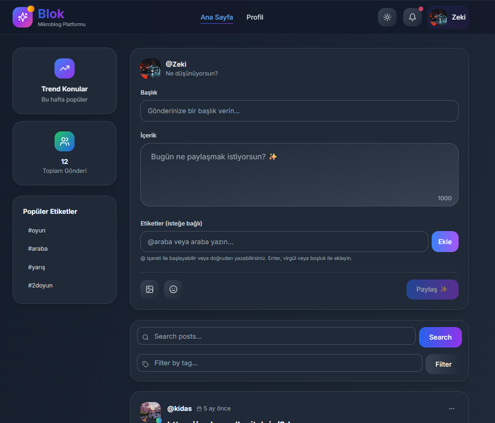
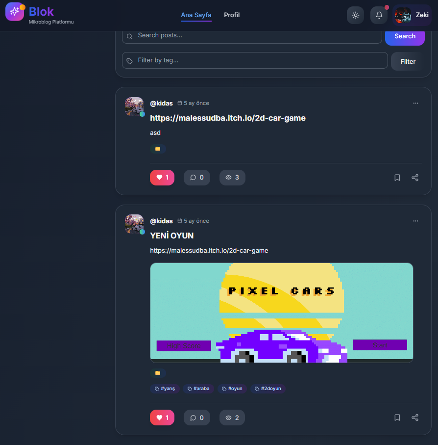
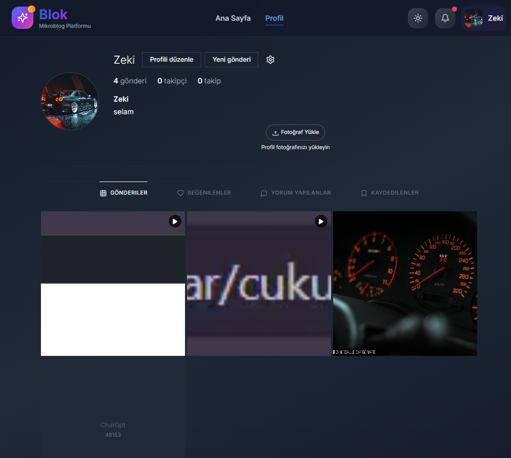
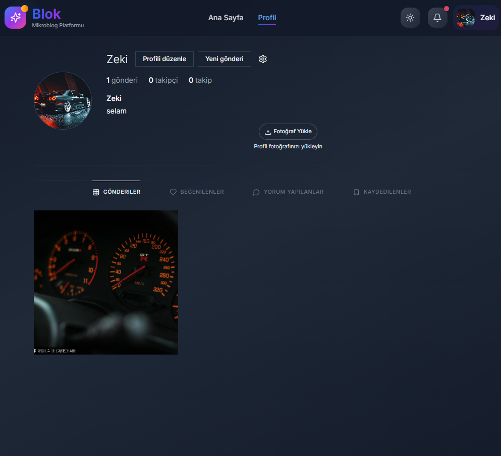
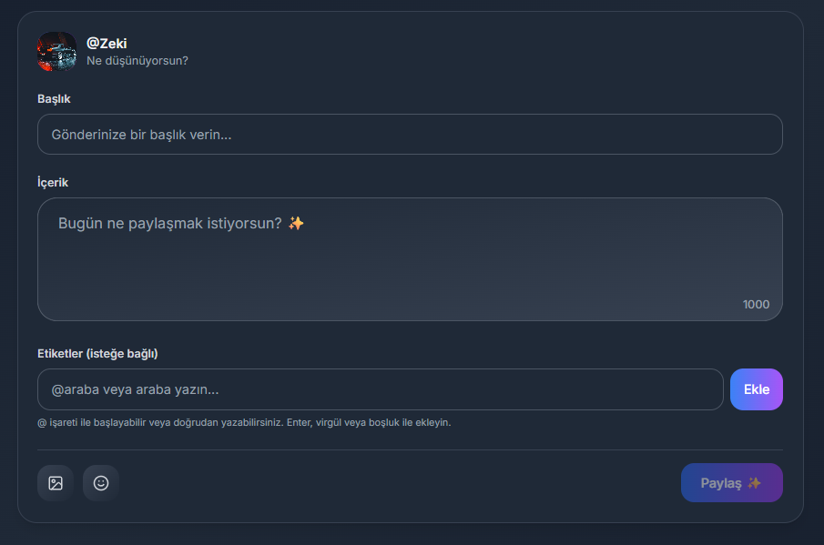
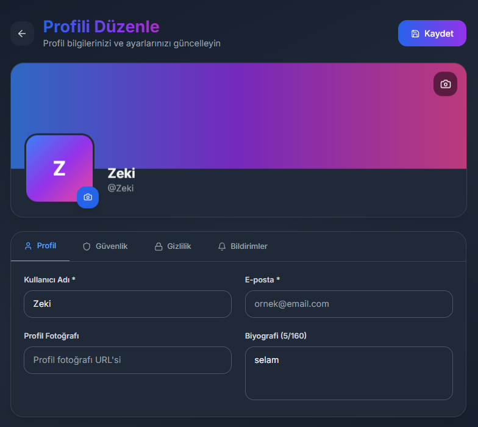
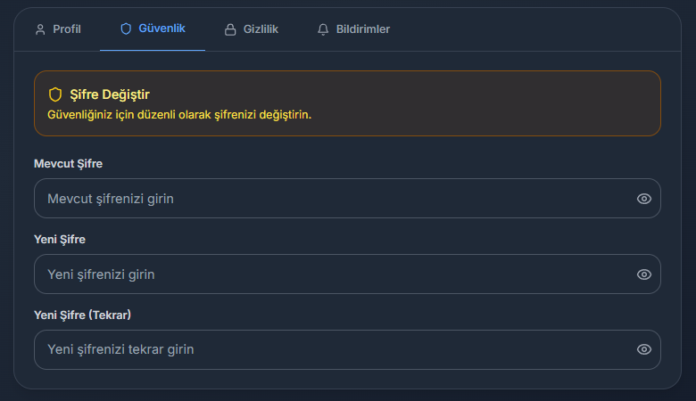
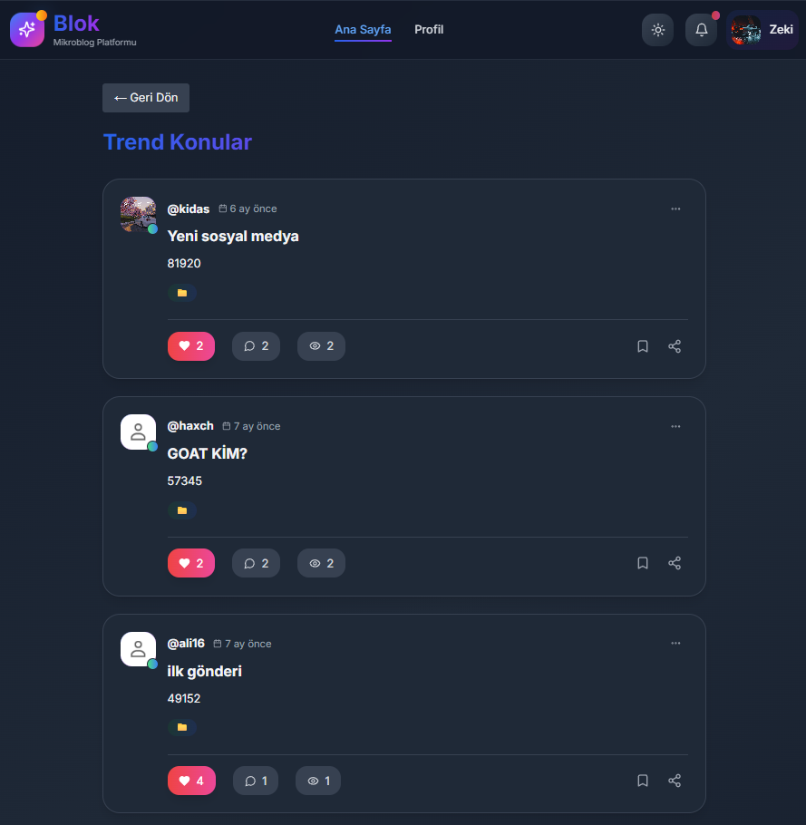
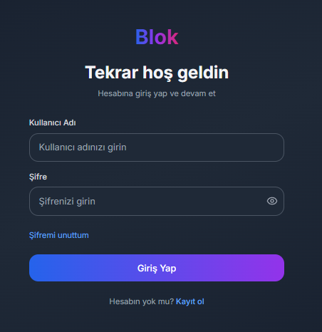
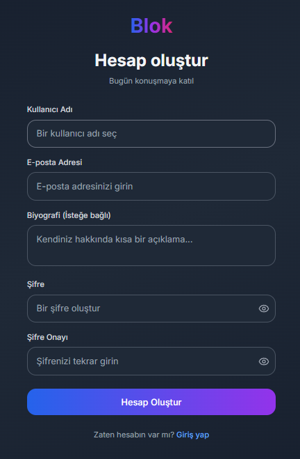

<div align="center">

# ✨ Blok — Microblogging Platform

**A modern, full-stack microblogging platform built with Spring Boot & Next.js**

[](https://openjdk.org/)
[](https://spring.io/projects/spring-boot)
[](https://nextjs.org/)
[](https://react.dev/)
[](https://www.postgresql.org/)
[](https://www.typescriptlang.org/)
[](https://www.docker.com/)
[](https://tailwindcss.com/)

<br/>



<p><em>A feature-rich social microblogging platform with real-time interactions, cloud media uploads, and a sleek dark-themed UI.</em></p>

</div>

---

## 📋 Table of Contents

- [Overview](#-overview)
- [Screenshots](#-screenshots)
- [Key Features](#-key-features)
- [Tech Stack](#-tech-stack)
- [Architecture](#-architecture)
- [Getting Started](#-getting-started)
- [API Endpoints](#-api-endpoints)
- [Environment Variables](#-environment-variables)
- [Deployment](#-deployment)
- [Contributing](#-contributing)
- [License](#-license)

---

## 🔍 Overview

**Blok** is a full-stack microblogging platform that enables users to create, share, and interact with short-form content. Inspired by modern social media platforms, it offers a complete set of social features including posts with media, comments, likes, bookmarks, tagging, trending topics, and a rich user profile system — all wrapped in an elegant dark-themed interface.

The application follows a **clean, layered architecture** with a RESTful Spring Boot backend and a server-rendered Next.js frontend, ensuring both performance and maintainability.

---

## 📸 Screenshots

<details>
<summary><strong>🏠 Homepage & Feed</strong> — Click to expand</summary>
<br/>

| Homepage | Post Feed |
|:---:|:---:|
|  |  |

</details>

<details>
<summary><strong>👤 User Profile</strong> — Click to expand</summary>
<br/>

| Profile (Posts Tab) | Profile (Gallery View) |
|:---:|:---:|
|  |  |

</details>

<details>
<summary><strong>✍️ Content Creation</strong> — Click to expand</summary>
<br/>

<div align="center">

<p><em>Rich post creation with title, content, tags, image upload, and emoji support</em></p>
</div>

</details>

<details>
<summary><strong>⚙️ Settings & Profile Management</strong> — Click to expand</summary>
<br/>

| Profile Settings | Security Settings |
|:---:|:---:|
|  |  |

</details>

<details>
<summary><strong>🔥 Trending & Discovery</strong> — Click to expand</summary>
<br/>

<div align="center">

<p><em>Discover trending topics and popular posts from the community</em></p>
</div>

</details>

<details>
<summary><strong>🔐 Authentication</strong> — Click to expand</summary>
<br/>

| Login | Register |
|:---:|:---:|
|  |  |

</details>

---

## ✨ Key Features

### 🔐 Authentication & Security
- **JWT-based authentication** with secure token management
- **Role-Based Access Control (RBAC)** — Admin and User roles
- **Password hashing** with Spring Security's BCrypt
- Password change & forgot password flows

### 📝 Content Management
- Create, edit, and delete posts with rich content
- **Image & media uploads** via Cloudinary cloud storage
- **Tag system** for content categorization
- **Category management** for organized content

### 💬 Social Interactions
- **Like / Unlike** posts with real-time counters
- **Comment system** with nested discussions
- **Bookmark / Save** posts for later reading
- **Share** posts via social links
- **View count tracking** per post

### 🔥 Discovery & Engagement
- **Trending Topics** — algorithmically surfaced popular content
- **Search & Filter** — full-text search with tag-based filtering
- **Popular Tags** sidebar with community-driven tags

### 👤 User Profiles
- Customizable profiles with **avatar upload**
- **Cover photo** with gradient fallback
- Profile tabs: Posts, Liked, Comments, Saved
- Bio, follower/following counts
- Multi-tab settings: Profile, Security, Privacy, Notifications

### 🎨 UI/UX
- **Dark theme** with sleek gradient accents
- Fully **responsive design** (mobile, tablet, desktop)
- **Shadcn UI** + **Radix UI** component library
- Smooth animations and micro-interactions
- Toast notifications via **Sonner**

---

## 🛠 Tech Stack

### Backend

| Technology | Purpose |
|---|---|
| **Spring Boot 3.5.3** | Application framework |
| **Java 17** | Programming language |
| **Spring Security** | Authentication & authorization |
| **Spring Data JPA** | Data persistence layer |
| **Hibernate** | ORM framework |
| **PostgreSQL** | Relational database |
| **JWT (jjwt)** | Stateless token authentication |
| **MapStruct** | DTO ↔ Entity mapping |
| **Lombok** | Boilerplate code reduction |
| **Cloudinary** | Cloud-based media storage |
| **Maven** | Build & dependency management |
| **Docker** | Containerization |

### Frontend

| Technology | Purpose |
|---|---|
| **Next.js 15** | React framework with SSR/SSG |
| **React 19** | UI library |
| **TypeScript** | Type-safe JavaScript |
| **Tailwind CSS** | Utility-first CSS framework |
| **Shadcn UI** | Accessible UI component library |
| **Radix UI** | Headless UI primitives |
| **React Hook Form** | Performant form management |
| **Zod** | Schema-based form validation |
| **Lucide React** | Icon library |
| **Sonner** | Toast notification system |
| **Recharts** | Data visualization (admin panel) |

---

## 🏗 Architecture

```
blok/
├── backend/                    # Spring Boot API
│   ├── src/main/java/com/blog/blok_api/
│   │   ├── config/             # Security, CORS, Cloudinary configs
│   │   ├── controller/         # REST API controllers
│   │   ├── dto/                # Data Transfer Objects
│   │   ├── exception/          # Global exception handling
│   │   ├── mapper/             # MapStruct mappers
│   │   ├── model/              # JPA entities
│   │   ├── repository/         # Spring Data repositories
│   │   ├── security/           # JWT filter, auth utilities
│   │   ├── service/            # Business logic layer
│   │   └── util/               # Utility classes
│   ├── Dockerfile              # Container configuration
│   └── pom.xml                 # Maven dependencies
│
├── frontend/                   # Next.js Application
│   ├── app/
│   │   ├── admin/              # Admin dashboard pages
│   │   │   ├── categories/     # Category management
│   │   │   ├── posts/          # Post moderation
│   │   │   ├── tags/           # Tag management
│   │   │   ├── users/          # User management
│   │   │   └── settings/       # Admin settings
│   │   ├── login/              # Login page
│   │   ├── register/           # Registration page
│   │   ├── forgot-password/    # Password recovery
│   │   ├── posts/              # Post detail pages
│   │   ├── profile/            # User profile pages
│   │   └── trendler/           # Trending topics page
│   ├── components/             # Reusable UI components
│   │   ├── ui/                 # Shadcn UI components
│   │   ├── Header.tsx          # Navigation header
│   │   ├── PostCard.tsx        # Post display card
│   │   ├── PostForm.tsx        # Post creation form
│   │   ├── CommentSection.tsx  # Comments component
│   │   ├── ShareModal.tsx      # Social sharing modal
│   │   └── SearchFilter.tsx    # Search & filter bar
│   ├── contexts/               # React context providers
│   ├── hooks/                  # Custom React hooks
│   └── lib/                    # Utility functions
│
└── screenshots/                # Application screenshots
```

---

## 🚀 Getting Started

### Prerequisites

| Requirement | Version |
|---|---|
| Java JDK | 17+ |
| Node.js | 18+ |
| Maven | 3.8+ |
| PostgreSQL | 14+ |
| Cloudinary Account | Free tier works |

### 1. Clone the Repository

```bash
git clone https://github.com/ZeQ61/blok.git
cd blok
```

### 2. Backend Setup

```bash
cd backend
```

**Create the database:**
```sql
CREATE DATABASE blogdb;
```

**Configure environment** — update `src/main/resources/application.properties`:
```properties
# Database
spring.datasource.url=jdbc:postgresql://localhost:5432/blogdb
spring.datasource.username=YOUR_DB_USERNAME
spring.datasource.password=YOUR_DB_PASSWORD

# Cloudinary
cloudinary.cloud-name=YOUR_CLOUD_NAME
cloudinary.api-key=YOUR_API_KEY
cloudinary.api-secret=YOUR_API_SECRET

# JWT
jwt.secret=YOUR_SECRET_KEY
```

**Run the backend:**
```bash
./mvnw spring-boot:run
```
> Backend will start at `http://localhost:8080`

### 3. Frontend Setup

```bash
cd frontend
npm install
npm run dev
```
> Frontend will start at `http://localhost:3000`

---

## 📡 API Endpoints

### Authentication
| Method | Endpoint | Description |
|---|---|---|
| `POST` | `/api/auth/register` | Register a new user |
| `POST` | `/api/auth/login` | Login & receive JWT token |

### Posts
| Method | Endpoint | Description |
|---|---|---|
| `GET` | `/api/posts` | Get all posts |
| `GET` | `/api/posts/{id}` | Get post by ID |
| `POST` | `/api/posts` | Create a new post |
| `PUT` | `/api/posts/{id}` | Update a post |
| `DELETE` | `/api/posts/{id}` | Delete a post |

### Comments
| Method | Endpoint | Description |
|---|---|---|
| `GET` | `/api/comments/post/{postId}` | Get comments for a post |
| `POST` | `/api/comments` | Add a comment |
| `DELETE` | `/api/comments/{id}` | Delete a comment |

### Likes
| Method | Endpoint | Description |
|---|---|---|
| `POST` | `/api/likes/toggle` | Toggle like on a post |
| `GET` | `/api/likes/post/{postId}` | Get likes for a post |

### Users
| Method | Endpoint | Description |
|---|---|---|
| `GET` | `/api/users/{id}` | Get user profile |
| `PUT` | `/api/users/{id}` | Update user profile |

### Saved Posts
| Method | Endpoint | Description |
|---|---|---|
| `POST` | `/api/saved-posts` | Save/unsave a post |
| `GET` | `/api/saved-posts` | Get saved posts |

### Categories & Tags
| Method | Endpoint | Description |
|---|---|---|
| `GET` | `/api/categories` | Get all categories |
| `GET` | `/api/tags` | Get all tags |

### Admin
| Method | Endpoint | Description |
|---|---|---|
| `GET` | `/api/admin/users` | List all users |
| `DELETE` | `/api/admin/users/{id}` | Delete a user |

---

## 🔐 Environment Variables

### Backend (`application.properties`)

| Variable | Description | Required |
|---|---|---|
| `spring.datasource.url` | PostgreSQL connection URL | ✅ |
| `spring.datasource.username` | Database username | ✅ |
| `spring.datasource.password` | Database password | ✅ |
| `cloudinary.cloud-name` | Cloudinary cloud name | ✅ |
| `cloudinary.api-key` | Cloudinary API key | ✅ |
| `cloudinary.api-secret` | Cloudinary API secret | ✅ |
| `jwt.secret` | JWT signing secret key | ✅ |

---

## 🐳 Deployment

### Docker

```bash
cd backend
docker build -t blok-api .
docker run -p 8080:8080 \
  -e SPRING_DATASOURCE_URL=jdbc:postgresql://host:5432/blogdb \
  -e SPRING_DATASOURCE_USERNAME=user \
  -e SPRING_DATASOURCE_PASSWORD=pass \
  -e JWT_SECRET=your-secret \
  blok-api
```

### Render (Cloud)

The project includes a `render.yaml` configuration for one-click deployment to [Render](https://render.com).

---

## 🤝 Contributing

Contributions are welcome! Here's how you can help:

1. **Fork** the repository
2. **Create** a feature branch (`git checkout -b feature/amazing-feature`)
3. **Commit** your changes (`git commit -m 'Add amazing feature'`)
4. **Push** to the branch (`git push origin feature/amazing-feature`)
5. **Open** a Pull Request

---

## 📄 License

This project is open source and available under the [MIT License](LICENSE).

---

<div align="center">

**Built with ❤️ using Spring Boot & Next.js**

<br/>


&nbsp;&nbsp;&nbsp;


</div>
